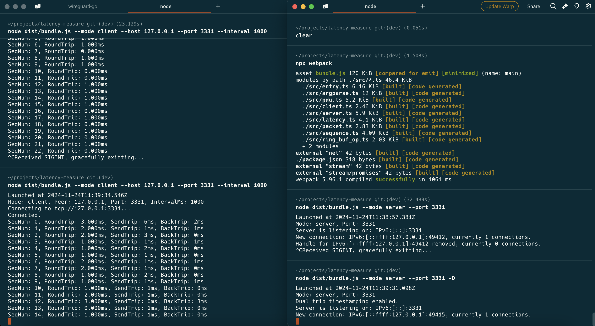

# sbtest: A stream-based TCP latency tester


## Basic usage

First launch an simple echo server in the server side where you are testing latency against:

```
ncat --keep-open --listen 12345 --exec '/usr/bin/cat'
```

An echo server only has to be as simple as be capable of echoing bytes.

Then in the client side where the connection is initiated from, runs the client program:

```
node ./dist/bundle.js --mode client --host <host> --port <port> --interval <millisecond>
```

## Print single trip latency (advanced)

To make the program be capable of printing single trip latency, the server side have to be aware of the packet and be able to modify packet to tag the timestamp on it, hence the client program would be able to calculate the delta between the client timestamp and the server timestamp tagged on the packet.

Instead of launch a simple echo server, launch this program in server mode and with an additional `-D` option like this:

```
node ./dist/bundle.js --mode server -D --port 14148
```

Doing so would instruct the program working in server mode and modify the packet to tag the timestamp on it.

Then still use `--mode client` in client clide to connect to this endpoint as before.

## Websocket transport

We are now supported WebSocket transport. WebSocket leverage HTTP message to peform handshaking thus make it convenient to reuse exisiting HTTP content delivery network, we have deployed a demo server at `wss://sbtest-demo.exploro.one` so that you may easily have a try:

```
node ./dist/app.js \
  --mode client \
  --websocket \
  --websocket-uri 'wss://sbtest-demo.exploro.one'
```

If you just wanna have a on-premise server deployment, you might use our docker build script at [scripts/build-docker-image.sh](scripts/build-docker-image.sh) to build a self-contained OCI container image, and then launch it by invoking:

```
docker run \
  -p 47851:47851 \
  --rm -dit \
  --name sbtest \
  sbtest:0.4 \
    --mode server \
    --websocket \
    --port 47851 \
    -D
```

See there's nothing special but only an additional `--websocket` parameter is added.

## Build from source

cd into this project's directory, then invokes:

```
npm install    # do this only at first build or after the dependency list (i.e. package.json) has been updated.
npm run build
```

If all goes well, the artifact output would be in `dist/app.js` related to current directory. You might ship this JavaScript script file to anywhere needed, without having to ship the whole `node_modules` dependencies together. Only a lts-versioned Node runtime is needed to installed for running it.

Also one could use the script at [scripts/build-docker-image.sh](scripts/build-docker-image.sh) to build an OCI container image, and the entrypoint has already set to `node path/to/script.js`.

For compliance and safety requirements, it's also ok to use docker to build it and docker to run it, i.e., build it in a container (or any sandboxed environment) and also run it inside a container (or any sandboxed environment). This is viable because the project only relys on Node runtime itself, and everything else from the libs had been already packed into the bundled output before it was built.

## Screenshot



## Todos

1. Supports proxy (tunnel, not gateway) type like SOCKS5, and HTTP Connect.
2. Prometheus metrics, for monitoring, visulization, alerting and analysis.
3. Supports `ProxyCommand` like that in ssh, so that these standard I/O based tunnel tools would then become useful to this.
4. Supports web target (i.e. running in browser environment). However, in that case, WebSocket might become the only available transport protocol that could use.
5. Allow optionally adjust the total size of PDU that are gonna used to exchange with the server, like that in `ping`, one could utilize this feature to study how does the size of PDU affects the behavior of the network.
6. Supports HTTP2 transport.
7. the 'daemon mode', allows a client to connects to it, and initiate ping tests on behalf of clients, and clients can use query apis to query currently ongoing pings, so, a daemon of this application serve as a ping resource objects manager, and a headless client. Think of it as a docker daemon but it only in charge of ping resource objects not container resource objects.
